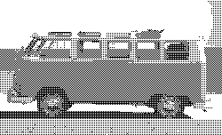
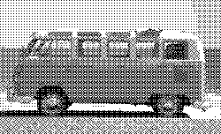
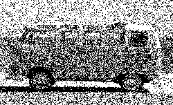
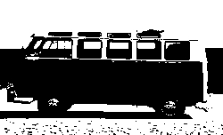

# Dithering

This is a command line tool for converting images to black and white using dithering techniques.

<p float="left">
  <br>
  
  
  
  
</p>

## Usage

```
go run main.go [image file] -m [dithering method] -f [output format] -o [output name] -q [output quality] -t [threshold value]
```

The following dithering methods are supported:

- "o4": Ordered 4x4 dithering
- "o9": Ordered 9x9 dithering
- "t": Threshold dithering
- "r": Random dithering
- "a": Apply all dithering methods and save the output with different names

The following output formats are supported:

- "jpg"
- "png"

The output quality parameter should be an integer between 1 and 100.

The threshold value is only used for threshold dithering.

If no arguments are provided, the program will use default values:

- Dithering method: "o4"
- Output format: "jpg"
- Output name: "output"
- Output quality: 100
- Threshold value: 0

The tool checks if the provided image file exists, and exits with an error message if it does not.

## Example Usage

```bash
go run main.go image.jpg -m o9 -f png -o image_o9 -q 75 -t 128
```

This will take the image "image.jpg", apply ordered 9x9 dithering, and save the output as a PNG image named "image_o9" with quality `75` and threshold `128`.


